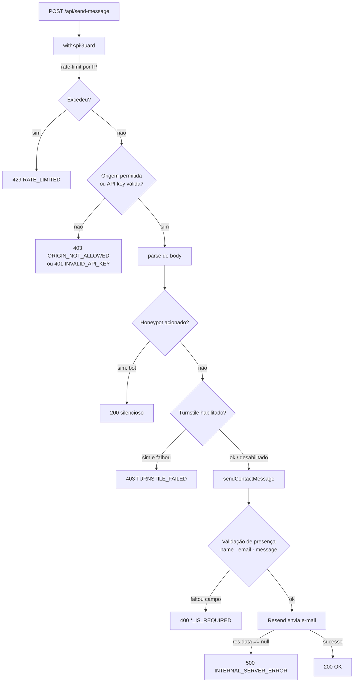

# CLAUDE.md

Guia para humanos e agentes de IA trabalharem neste repositório.

---

## 1. Visão geral

**Portfólio pessoal** (site) com um backend mínimo e propositalmente enxuto.

O frontend é o próprio site — apresentação profissional (sobre, skills,
experiência, projetos, certificações, contato) construída com componentes React
sobre o App Router do Next.js.

O backend resolve **um único problema**: receber o formulário de contato com
segurança. Expõe **um endpoint** — `POST /api/send-message` — que aplica
proteções anti-abuso (rate-limit, origem, honeypot, CAPTCHA) e dispara um
e-mail transacional via Resend.

> O design é deliberadamente assimétrico: a superfície de backend é pequena, mas
> bem defendida. Não há banco de dados, sessão ou autenticação de usuário — só
> entrega de e-mail protegida.

---

## 2. Conceitos principais

| Conceito | O que significa aqui |
|---|---|
| **Endpoint único** | Todo o backend é `POST /api/send-message`. Não há CRUD, nem múltiplas rotas de API. |
| **Falha fechada** | Sem env configurada, as checagens de segurança **negam** por padrão (API key, Turnstile). Segurança nunca depende de "esquecer de bloquear". |
| **Defesa em camadas** | A requisição atravessa rate-limit → origem/API key → honeypot → Turnstile → validação → envio. Cada camada é um módulo coeso e isolado. |
| **Contrato estável** | Códigos de erro, status HTTP e shapes de resposta são parte do contrato e **não mudam sem intenção explícita**. |
| **Frontend não tem segredo** | Uma key no browser não é secreta. Por isso a proteção do frontend é por **allowlist de origem**, não por chave embutida. |
| **Resultado discriminado** | A ação de negócio retorna `{ ok: true } \| { ok: false; error; status }`; o handler HTTP apenas mapeia isso para a resposta. |

---

## 3. Tecnologias e stack

| Categoria | Tecnologia | Versão |
|---|---|---|
| Framework | **Next.js** (App Router) | `16.2.9` |
| UI | **React** / React DOM | `19.2.4` |
| Linguagem | **TypeScript** | `^5` |
| E-mail | **Resend** (template `contact`) | `^6.14.0` |
| CAPTCHA | **Cloudflare Turnstile** (invisível, opcional via env) | — |
| Estilos | **Tailwind CSS** (via `@tailwindcss/postcss`) | `^4` |
| Lint + Format | **Biome** (substitui ESLint/Prettier) | `2.2.0` |
| Testes | **Vitest** | `^4.1.9` |
| Runtime/Deploy | **Node 24 (Alpine)** · Docker · Nginx | — |

> ⚠️ **Next.js 16 pode divergir do que você conhece.** APIs, convenções e
> estrutura de arquivos mudam entre versões. Antes de escrever código que toca
> em APIs do framework, leia o guia relevante em `node_modules/next/dist/docs/`.
> Ex.: o antigo `middleware.ts` foi renomeado para `proxy.ts` nesta versão.

---

## 4. Arquitetura

### Estrutura lógica

```
src/
  app/                         # App Router (rotas, layout, páginas)
    api/send-message/route.ts  # handler fino: guard → parse → anti-abuso → ação → resposta
    layout.tsx · page.tsx · links/page.tsx
  server/                      # backend server-only (FORA da árvore de rotas)
    security/                  # acesso + anti-abuso (coeso)
      guard.ts                 # withApiGuard: orquestra rate-limit + origin/api-key
      rate-limit.ts            # fixed-window em memória (interface troca p/ Redis)
      origin.ts                # allowlist de Origin/Referer (proteção do frontend)
      api-key.ts               # validação x-api-key (consumidores server-to-server)
      honeypot.ts              # campo-isca anti-bot
      turnstile.ts             # verificação Cloudflare Turnstile
    contact/
      send-contact-message.ts  # ação de negócio: validação (presença) + envio Resend
    http/
      client-ip.ts             # getClientIp (x-forwarded-for / x-real-ip)
  components/                  # componentes React do site
  layout/                      # Header, Footer, Layout
  styles/                      # globals.css (Tailwind)
  tests/                       # TODOS os testes (vitest), espelhando src/
```

### Fluxo da requisição (`POST /api/send-message`)



1. **`withApiGuard`** — rate-limit por IP (fixed-window, padrão `5 / 60s`);
   depois origem (frontend) **ou** API key (server-to-server).
2. **Parse do body** + **honeypot** (bot → `200` silencioso, sem revelar a
   defesa).
3. **Turnstile**, se habilitado por env (falha → `403`).
4. **`sendContactMessage`** — valida presença dos campos e envia via Resend;
   retorna resultado discriminado que o handler mapeia para HTTP.

### Infraestrutura (produção)

```
Internet ──► Nginx (80/443, TLS) ──► app1 ─┐
                                            ├─ réplicas Next.js (standalone, :3000)
                                    └─► app2 ┘
```

- Build Next.js em modo **`standalone`** (`next.config.ts`), empacotado em
  imagem Docker multi-stage (`deps → builder → runner`), rodando como usuário
  não-root com `HEALTHCHECK`.
- **Duas réplicas** (`app1`, `app2`) atrás de **Nginx** como reverse proxy /
  load balancer e terminação TLS.
- Deploy **rolling, sem downtime**: atualiza uma réplica de cada vez, esperando
  ficar `healthy` antes da próxima (ver `scripts/deploy.sh`).

---

## 5. Princípios de design

- **SOLID/DRY proporcionais ao tamanho.** O backend tem um endpoint; portanto,
  **sem** camadas pesadas (controller/service/repository/DTO). A divisão é por
  **responsabilidade**, não por dogma.
- **SRP no route handler.** O `route.ts` orquestra HTTP; regra de negócio e
  segurança vivem em módulos próprios.
- **Falha fechada na segurança.** Sem env configurada, as checagens negam por
  padrão.
- **Contrato da API é estável.** Códigos de erro, status e shapes não mudam sem
  intenção explícita.
- **Interfaces no lugar de acoplamento.** O rate-limiter é uma `interface`
  (`RateLimiter`) — hoje em memória, trocável por Redis sem tocar no handler.
- **Comentário só explica o "porquê".** Nada que apenas repita o código.

### Lógica da organização

- **`src/server/` e não `src/lib/`** — as proteções têm **lógica de segurança
  própria do domínio**; não são utilitários genéricos.
- **`src/server/` e não dentro de `app/api/`** — a árvore do App Router é para
  **roteamento**. Módulos de apoio ali poluiriam esse significado.
- **`security/ · contact/ · http/`** — única divisão que se paga: acesso/
  anti-abuso, regra de negócio e utilitário de request. Mais camadas seria
  over-engineering para um endpoint.

---

## 6. Ferramentas

| Tarefa | Comando | Ferramenta |
|---|---|---|
| Dev server | `npm run dev` | Next.js |
| Build de produção | `npm run build` | Next.js (`standalone`) |
| Rodar o build | `npm start` | Next.js |
| Lint + organizar imports | `npm run lint` | Biome (`biome check`) |
| Formatar | `npm run format` | Biome (`biome format --write`) |
| Testes (uma vez) | `npm test` | Vitest |
| Testes (watch) | `npm run test:watch` | Vitest |

- **CI/CD** — `.github/workflows/ci-cd.yml`: em `push` para `master`, conecta no
  VPS via SSH, faz `git pull --ff-only` e executa `./scripts/deploy.sh`
  (rolling deploy). `concurrency` impede deploys concorrentes.
- **Containerização** — `Dockerfile` (multi-stage) + `docker-compose.yml`
  (2 réplicas + nginx).
- **Vitest** — glob `src/**/*.test.ts` (ver `vitest.config.ts`).

---

## 7. Estrutura de pastas

| Caminho | Responsabilidade |
|---|---|
| `src/app/` | App Router: rotas, `layout.tsx`, `page.tsx`, página `links/`. |
| `src/app/api/send-message/route.ts` | Handler HTTP fino do endpoint de contato. |
| `src/server/security/` | Controle de acesso e anti-abuso (guard, rate-limit, origin, api-key, honeypot, turnstile). |
| `src/server/contact/` | Regra de negócio: validação de presença e envio via Resend. |
| `src/server/http/` | Utilitário de request (`getClientIp`). |
| `src/components/` | Componentes React do site (About, Skills, Experience, Contact, …). |
| `src/layout/` | Header, Footer, Layout. |
| `src/styles/css/` | `globals.css` (Tailwind). |
| `src/tests/` | Todos os testes Vitest, um arquivo por módulo (`*.test.ts`). |
| `nginx/` | `nginx.conf` + `certs/` (TLS). |
| `scripts/deploy.sh` | Rolling deploy sem downtime no VPS. |
| `.github/workflows/` | Pipeline de deploy. |

---

## 8. Como rodar o projeto

### Setup local

```bash
npm install          # instala dependências
cp .env.example .env # configure as variáveis (ver abaixo)
npm run dev          # http://localhost:3000
```

### Variáveis de ambiente

Ver `.env.example`. Convenção: segredos só no servidor; `NEXT_PUBLIC_*` é
exposto ao browser por design.

| Variável | Obrigatória | Função |
|---|---|---|
| `RESEND_API_KEY` | sim | Autentica o envio de e-mail no Resend. |
| `RESEND_EMAIL_TO` | sim | Destinatário (e remetente do template) do contato. |
| `API_KEY` | opcional | Habilita consumidores server-to-server via `x-api-key`. |
| `TURNSTILE_SECRET_KEY` | opcional | Ativa a verificação Turnstile no servidor. |
| `NEXT_PUBLIC_TURNSTILE_SITE_KEY` | opcional | Site key do widget Turnstile (público). |

> **Falha fechada:** sem `TURNSTILE_SECRET_KEY` o CAPTCHA fica desabilitado;
> sem `API_KEY` o acesso server-to-server é negado. A proteção do formulário do
> site permanece via allowlist de origem.

### Produção (Docker)

```bash
docker compose up -d --build   # sobe app1, app2 e nginx
./scripts/deploy.sh            # rolling deploy (rebuild + troca réplica a réplica)
```

---

## 9. Convenções para a IA (Claude)

- **Imports:** no código de app, alias `@/*` → `src/*` (ex.:
  `@/server/security/guard`). Nos **testes**, use **caminhos relativos** (o
  Vitest não resolve o alias). Biome organiza os imports automaticamente.
- **Formatação:** Biome, 2 espaços. Rode `npm run format` antes de commitar.
- **Testes:** em `src/tests/`, um arquivo por módulo, nome `*.test.ts`.
- **Antes de tocar em APIs do Next.js:** leia `node_modules/next/dist/docs/` —
  esta versão pode divergir do que você conhece (ex.: `proxy.ts`).
- **Comentários** explicam o **porquê**, nunca o **o quê**.

### Boundaries

- **Sempre:** rodar `npm test` e `npm run lint` antes de commitar; usar `git mv`
  ao mover arquivos; manter os contratos da API (status, códigos de erro,
  shapes).
- **Perguntar antes:** mudar dependências, alterar contrato/validação da API,
  renomear endpoints.
- **Nunca:** commitar segredos; afrouxar/remover testes só para "passar";
  expor chave secreta ao frontend; tornar uma checagem de segurança
  "falha aberta".

---

## 10. Uso de IA no desenvolvimento

Este projeto foi desenvolvido com **assistência de IA** (Claude Code, da
Anthropic), usada como par de programação ao longo do trabalho:

- **Arquitetura e organização** — discussão da fronteira `server/` vs `app/`,
  da divisão `security · contact · http` e do princípio de "falha fechada".
- **Camadas de segurança** — implementação e revisão de rate-limit, allowlist de
  origem, honeypot e integração com Turnstile.
- **Infraestrutura** — Dockerfile multi-stage, `docker-compose` com réplicas,
  Nginx e o script de rolling deploy sem downtime.
- **Testes e qualidade** — geração de testes Vitest por módulo e padronização
  via Biome.

Os commits assistidos são marcados com `Co-Authored-By` apontando para o
modelo. **Toda saída de IA passou por revisão humana** antes do merge — a
decisão de design e a responsabilidade final são do mantenedor.
